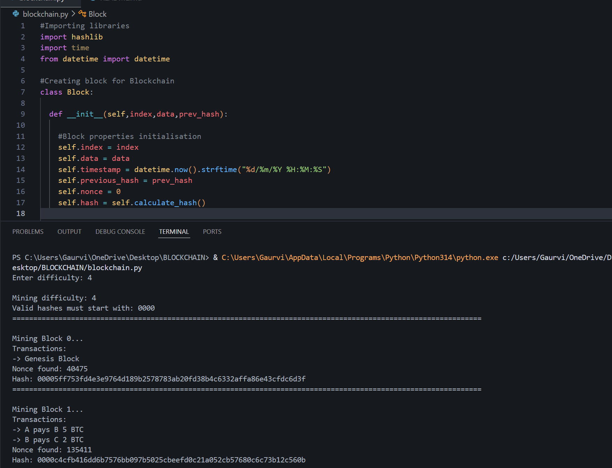
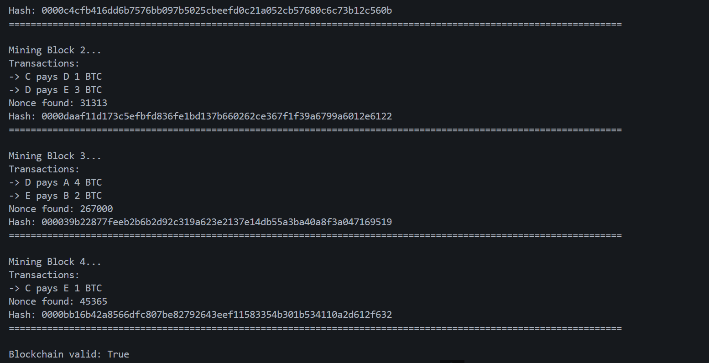
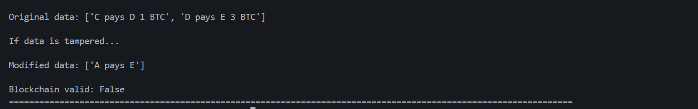

# Simple Proof of Work Blockchain

## Project Overview
This project is a simple blockchain simulation built using Python.
It demonstrates how the mining, hashing and Proof of Work (PoW) consensus meachanism works internally.
The project implements:
- Block creation
- SHA-256 hashing
- Proof of Work mining
- Blockchain validation
- Tampering detection
The goal of this project is to understand the core concepts behind blockchain technology and how blocks are securely linked together using cryptographic hashes.

## Features
- Block creation
- SHA-256 hashing
- Proof of Work mining
- Nonce-based mining
- Blockchain validation
- Multiple transactions per block
- Tampering detection
- Adjustable mining difficulty
- Human-readable timestamps

## Block Structure
Each block in the blockchain contains:
- Block index
- Timestamp
- Transaction data
- Previous block hash
- Nonce value
- Current block hash

## SHA-256 Hashing
This project uses the SHA-256 hashing algorithm provided by Python’s hashlib library.
The block hash is generated using:
- Transaction data
- Timestamp
- Previous hash
- Nonce value
Even a very small change in block data generates a completely different hash, which helps detect tampering.

## Proof of Work Mining
Mining is implemented using the Proof of Work consensus mechanism.
The mining process continuously changes the nonce value until a valid hash is found.
A valid hash must begin with a certain number of leading zeros depending on the mining difficulty.

The nonce is a number used during mining.Changing the nonce generates a completely different hash.
The nonce value is continuosly changed to search for a hash that satisfies the Proof of Work condition.

## Blockchain Validation
The blockchain validation system checks:
- whether block hashes are correct
- whether previous hash references are valid
- whether blocks satisfy the Proof of Work condition
If any of the above fails, blockchain validation fails.

## Tampering Detection
The project demonstrates blockchain security by manually modifying transaction data after mining.
When block data is changed, the recalculated hash becomes different and the blockchain validation and chain integrity fails.

## Why Higher Difficulty Increases Mining Time
Higher mining difficulty requires hashes with more leading zeros.
As the number of required leading zeros increases, valid hashes become rarer and more nonce attempts are needed.
This increases mining time.

This project demonstrates the fundamental working principles of blockchain technology and Proof of Work mining.

## Output

